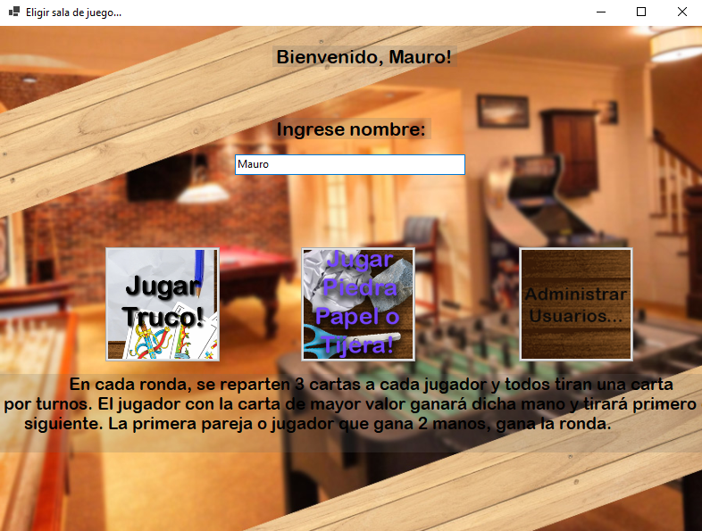
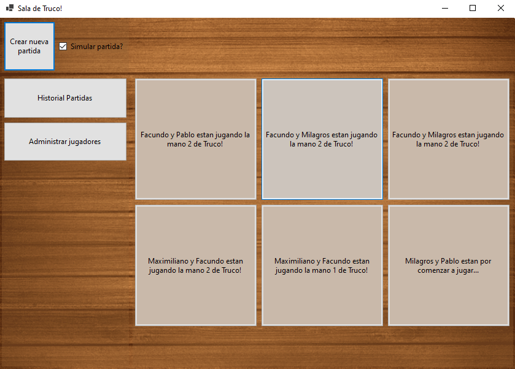
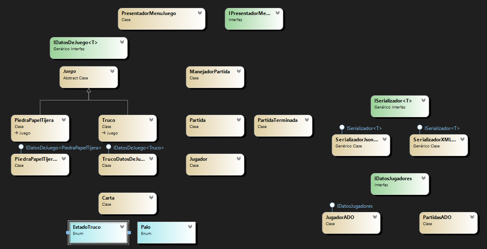

### Segundo Parcial Laboratorio de Programación II por Mauro Luciano.
---
# Sobre la aplicación
**Titulo:** Simulador 'ArgenJuegos'

**Sobre mí:** Soy Mauro, estudiante del segundo cuatrimestre de la carrera, y alumno de la comisión 2A con Maximiliano Neiner a cargo. La aplicación fue bastante difícil, como era la primera vez haciendo un juego un juego de cartas y además por turnos encarar ese problema fue lo que llevó más tiempo. Fue bastante divertido hacer el parcial, ya que no era un ABM o algo así; está bueno saber que se pueden hacer mucho más cosas fuera de eso, aplicando todo lo que se aprende durante la cursada. Le puse bastante ganas a la parte visual esta vez, ya que los temas que había que aplicar no eran muy extensos como en el primer parcial. Como desde el inicio pensé en hacer la aplicación teniendo en mente la expansión (agregar otros juegos) apliqué (o por lo menos se intentó en la medida de lo posible xD) el patrón arquitectónico Modelo-Vista-Presentador con el objetivo de tener una clase de instancia que maneje la lógica de negocio de la aplicación y una vista que tenga la menor cantidad de lógica posible.

**Resumen:** La aplicación es un simulador de juegos, donde adicionalmente se puede jugar contra la máquina. Consta de sólo 3 tipos de formularios: el principal, el de menú de juego donde se puede crear salas de juego simuladas o vs la máquina y el de visualización de partida.

# Formulario principal

En este formulario se puede elegir el juego y un nombre de jugar que será utilizado a lo largo del programa.



# Formulario menú de juego

Aquí se podrá crear partidas del juego elegido anteriormente, simuladas o vs la máquina. Cada botón generado corresponde a una partida en curso, si se decide jugar contra la máquina el formulario de partida se abrirá automáticamente.



# Formulario partida

En una partida en curso, se podrá visualizar el estado de la misma en este formulario. Se mostrará la partida en curso de manera gráfica y en texto, y adicionalmente se podrá cancelar la partida.


Si se decide jugar vs la máquina el formulario se presentará con un diálogo adicional.


# Diagrama de clases

# Entidades


# Forms


# Justificación técnica

## Excepciones

## Excepciones
Se utilizaron excepciones para manejar los posibles errores en tiempo de ejecución a la hora de obtener jugadores desde la base de datos.
```
try
{
    comando = new SqlCommand();

    comando.CommandType = CommandType.Text;
    comando.CommandText = "SELECT id, nombre, apellido, esHumano, trucoGanadas, trucoPerdidas, piedrapapeltijeraGanadas, piedrapapeltijeraPerdidas FROM dbo.Jugadores";
    comando.Connection = conexion;

    conexion.Open();

    lector = comando.ExecuteReader();
    while (lector.Read())
    {
        Jugador item = new Jugador();

        item.Id = lector.GetInt32(0);
        item.Nombre = lector.GetString(1);
        item.Apellido = lector.GetString(2);
        item.EsHumano = lector.GetBoolean(3);
        item.CantidadVictoriasTruco = lector.GetInt32(4);
        item.CantidadDerrotasTruco = lector.GetInt32(5);
        item.CantidadVictoriasJanKenPon = lector.GetInt32(6);
        item.CantidadDerrotasJanKenPon = lector.GetInt32(7);

        lista.Add(item);
    }

    lector.Close();

}
catch (Exception ex)
{
    Console.WriteLine(ex.ToString());
}
finally
{
    if (conexion.State == ConnectionState.Open)
    {
        conexion.Close();
    }
}
```
## Pruebas unitarias
Se realizaron test unitarios para comprobar la funcionalidad del código y reducir los posibles errores al refactorizar e integrar con el resto del programa.


## Tipos genéricos
## Interfaces
## Archivos
## Serialización
## SQL
## Delegados y expresiones lambda
## Programación multi-hilo y concurrencia
## Eventos
## Métodos de extensión
